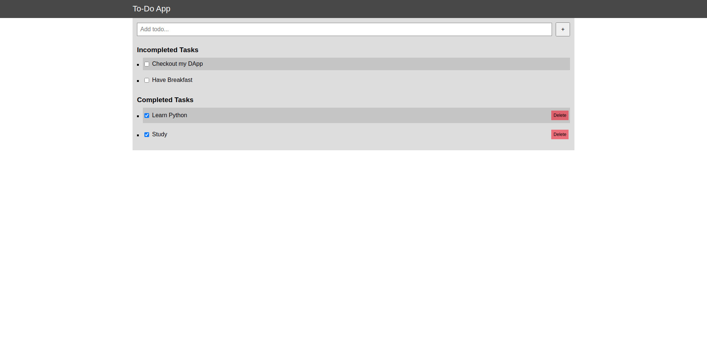
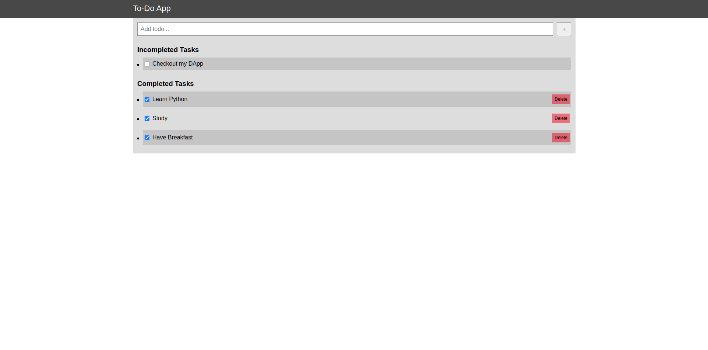

<!-- ABOUT THE PROJECT -->
## About The Project
Blockchain ToDoList DApp

A simple decentralized To-Do List application built on Ethereum blockchain using Solidity, Truffle, Web3.js, and MetaMask.
Users can add tasks, mark them as completed, and delete tasks. All actions are stored on the blockchain for transparency and immutability.

🚀 Features

✍️ Add new tasks to the blockchain

✅ Mark tasks as completed

❌ Delete tasks (soft delete using a flag)

🔗 All data stored on Ethereum blockchain (no centralized DB)

👛 MetaMask wallet integration for transactions

🛠️ Tech Stack

Frontend: HTML, CSS, JavaScript

Smart Contracts: Solidity

Blockchain Tools: Truffle, Ganache, Web3.js

Wallet: MetaMask


<br>

This is a simple to-do list app using Blockchain technology.
A list of commonly used resources that I find helpful are listed in the acknowledgements.

### Built With
* [Truffle](https://www.trufflesuite.com/truffle)
* [Ganache](https://www.trufflesuite.com/ganache)
* [Solidity](https://docs.soliditylang.org/en/v0.8.4/)
* [Ethereum](https://ethereum.org/en/)


<!-- GETTING STARTED -->
## Getting Started

To get a local copy up and running follow these simple example steps.

### Prerequisites

These things must be installed in your system.
* [Truffle](https://www.trufflesuite.com/truffle)
* [Ganache](https://www.trufflesuite.com/ganache)
* [NPM](https://nodejs.org/en/)

### Installation

1. Clone the repo
   ```sh
   git clone https://github.com/DebjitPramanick/Blockcahin-To-Do-List.git
   ```
2. Open the project folder
3. Install NPM
	```sh
   npm i
   ```
4. Now run Ganache
5. Now type in the command in terminal
    ```sh
   truffle migrate
   ```
6. Now type
    ```sh
   npm run dev
   ```
   
<!-- USAGE EXAMPLES -->
## Usage

Here are some examples of how my app works.
<br>

<br>

<br>


